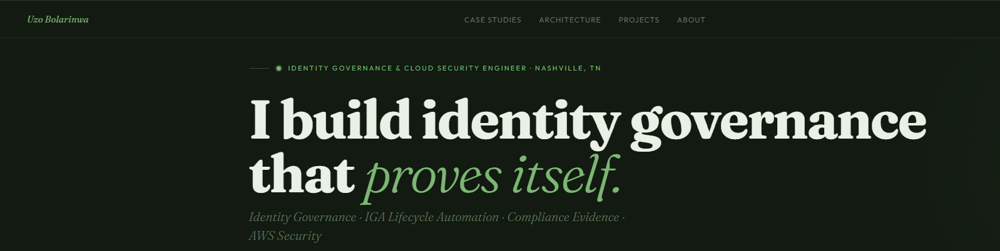

  

<h1 align="center">Uzo Bolarinwa</h1>

<strong>Identity Governance &amp; Cloud Security Engineer</strong>

  

<em>Start at the portfolio site for the case studies and architecture. The repositories below are the working code behind it.</em>

---

## How My Work Connects

A single connected AWS cloud security program, not a pile of unrelated repos. Every project is a working artifact, documented the way it would be on the job: architecture, controls, evidence, and threat models.

The program spans seven layers: GRC and evidence automation, secure cloud architecture, identity and access governance, detection engineering, incident response readiness, policy as code, and security communication.

**Current focus:** extending identity governance from the human lifecycle (joiner, mover, leaver) into non-human and AI-agent identity governance.

---

## Certifications

| Certification | Issuer | Status |
|---|---|---|
| AWS Certified Security – Specialty | AWS | ✅ Active |
| AWS Certified Solutions Architect – Associate | AWS | ✅ Active |
| CompTIA Security+ | CompTIA | ✅ Active |
| Red Hat Certified Engineer (RHCE) | Red Hat | ✅ Active |
| Red Hat Certified System Administrator (RHCSA) | Red Hat | ✅ Active |
| Project Management Professional (PMP) | PMI | ✅ Active |
| AWS Solutions Architect – Professional (SAP-C02) | AWS | 📖 In progress |
| Microsoft Identity & Access Administrator (SC-300) | Microsoft | 📖 In progress |

---

## Technical Skills

| Category | Skills |
|---|---|
| **Identity & Access Governance** | IGA, IAM, midPoint, 389 Directory Server / LDAP, RBAC, joiner-mover-leaver lifecycle, reconciliation, access certification, non-human identity governance, federation (OIDC / SAML), Cognito, Entra ID |
| **Cloud Security** | AWS Organizations (multi-account), GuardDuty, Security Hub, Config, CloudTrail, KMS, VPC design, Zero Trust |
| **GRC & Compliance Automation** | SOC 2, NIST 800-53, NIST CSF, ISO 27001, PCI DSS, CIS, control mapping, risk scoring, evidence automation |
| **Identity Threat Detection** | CloudTrail telemetry, EventBridge, MITRE ATT&CK (T1078, T1550.001), severity scoring, alert triage |
| **IaC & Policy as Code** | AWS CDK, Terraform, policy-as-code (OPA Rego, conftest), Python (boto3), Groovy, Bash, GitHub Actions |
| **Linux & Platform** | RHEL, Linux systems administration, SELinux, hardening |

---

## 📁 Portfolio

| Layer | Repository | What it demonstrates | Status |
|---|---|---|---|
| **Non-Human & Agent Identity (frontier)** | [aws-nhi-governance-engine](https://github.com/uzobola/aws-nhi-governance-engine) | Cloud non-human identity governance engine: eleven detectors for ownership, over-privilege (managed-policy and unused permissions), trust-policy exposure (wildcard, cross-account without ExternalId, OIDC aud/sub gaps), and credential model, mapped to OWASP NHI Top 10 and NIST 800-53; exception register with net-residual reporting; JSON and Markdown audit reports; documented threat model; CI gate on HIGH/CRITICAL findings; unit-tested; extending into AI-agent identity governance | ✅ Shipped |
| **Identity & Access Governance** | [enterprise-iam-lifecycle-automation](https://github.com/uzobola/enterprise-iam-lifecycle-automation) | midPoint + 389 Directory Server lifecycle (joiner, mover, leaver); reconciliation; unmatched service-account (NHI) disposition; Python evidence validator with control mapping | ✅ Shipped |
| **GRC & Evidence Automation** | [aws-grc-engineering-project](https://github.com/uzobola/aws-grc-engineering-project) | 16 automated controls across 6 domains; SOC 2 / NIST 800-53 / CSF / ISO 27001 / PCI DSS / CIS mapping; risk scoring; IAM governance module and immutable evidence vault | ✅ Shipped |
| **Policy as Code (Prevention)** | [aws-policy-as-code-guardrails](https://github.com/uzobola/aws-policy-as-code-guardrails) | Preventive OPA Rego guardrails evaluated against Terraform plans before apply; conftest CI gate; opa-tested; findings mapped to NIST 800-53 (SC-7, AC-6(10), SC-28, CM-8); the shift-left counterpart to the NHI engine's detective controls | ✅ Shipped |
| **Identity Threat Detection** | [iam-cross-account-detection-pipeline](https://github.com/uzobola/iam-cross-account-detection-pipeline) | Real-time AssumeRole detection (CloudTrail → EventBridge → Lambda → SNS); MITRE ATT&CK T1078 and T1550.001; severity scoring; trusted-role allowlist | ✅ Shipped |
| **Secure Cloud Architecture** | [secure-multi-account-retail-architecture](https://github.com/uzobola/secure-multi-account-retail-architecture) | AWS Organizations multi-account isolation, centralized logging, layered ingress, threat model with preventive, detective, responsive, and governance controls | ✅ Shipped |
| **Identity & Access Governance** | [zero-trust-serverless-cdk](https://github.com/uzobola/zero-trust-serverless-cdk) | Zero Trust serverless API (Cognito as OIDC IdP, API Gateway, Lambda, DynamoDB); OIDC/JWT auth with sub-claim binding against BOLA/IDOR; route-level least privilege; controls matrix and evidence | ✅ Shipped |

---

## Connect

- 💼 LinkedIn: [linkedin.com/in/uzobolarinwa](https://www.linkedin.com/in/uzobolarinwa)
- 🌐 Portfolio: [uzobolarinwa.com](https://uzobolarinwa.com)
- 📧 Email: uzo@uzobolarinwa.com
